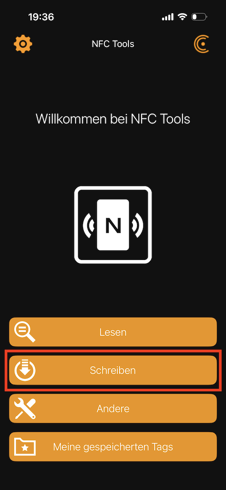
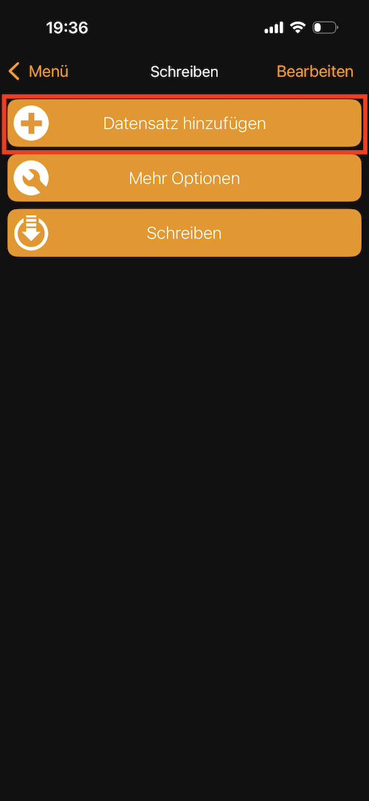
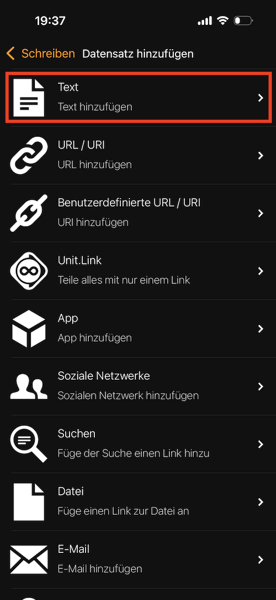
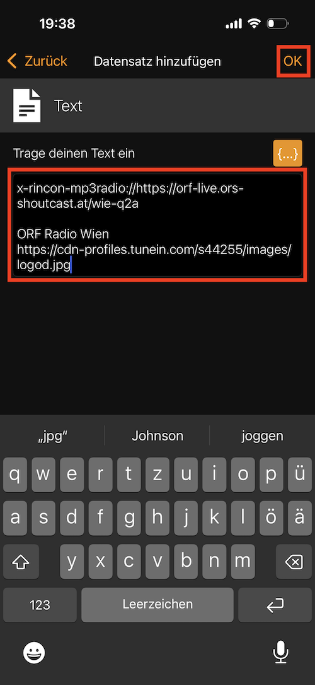
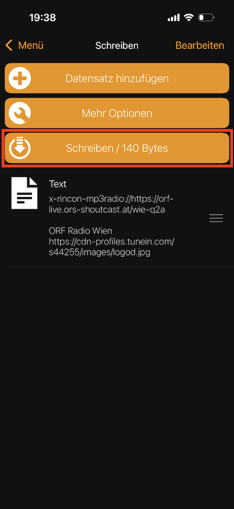

# Applikationsbeschreibung Sonos NFC-Player

## Wichtige Hinweise

* Diese KNXprod wird nicht von der KNX Association offiziell unterstützt!
* Die Erzeugung der KNXprod geschieht auf Eure eigene Verantwortung!

## Module

Die Sonos App besteht aus folgenden Modulen:

- [Basiseinstellungen](https://github.com/OpenKNX/OGM-Common/blob/v1/doc/Applikationsbeschreibung-Common.md)
- [Netzwerk](https://github.com/OpenKNX/OFM-Network/blob/v1/doc/Applikationsbeschreibung-Netzwerk.md)
- [Sonos](https://github.com/OpenKNX/OFM-Sonos/blob/v1/doc/Applikationsbeschreibung-Sonos.md)
- [Player](#player)
- [Logik](https://github.com/OpenKNX/OFM-LogicModule/blob/v1/doc/Applikationsbeschreibung-Logik.md)
- [Funktionsblöcke](https://github.com/OpenKNX/OFM-FunctionBlocks/blob/v1/doc/Applikationsbeschreibung-FunctionBlocks.md)


<!-- DOC -->
## Player

Der Player spielt Quellen deren Referenz in einem Standard NFC Tag hinterlegt ist auf dem Sonos System ab.

Die NFC Tags müssen mit einem NFC-NDEF-Record des Types 'Text' programmiert werden.

### Programmierung der NFC Tags

Die NFC Tags werden am Besten mit einem Mobiltelefon beschrieben.

Beispielsweise kann die App 'NFC Tools' dazu verwendet werden. 
<!-- DOC Skip="1"-->
[Apple Store](https://apps.apple.com/at/app/nfc-tools/id1252962749), [Google Play Store](https://play.google.com/store/apps/details?id=com.wakdev.wdnfc&hl=de_AT)

### Befehlssyntax

Befehle bestehen aus einem **Namen** und optional einem **Parameter**.  
Mehrere Befehle werden mit `;` getrennt. 
Der Befehlsname ignoriert Groß- und Kleinschreibung.
Bei den Paramtern ist die Groß- und Kleinschreibung jedoch relevant.

#### Grundform

Befehl\[:Parameter\]\[;Befehl\[:Parameter\]\]  
Befehl\[:Parameter\]\[;Befehl\[:Parameter\]\]...

#### Trennzeichen

- `;` oder Zeilenumbruch trennt Befehle
- `:` Trennt Befehl und Parameter
- `"` oder `'` begrenzt einen Parameter

#### Parameter

- Parameter sind **optional**
- Parameter können **quoted** oder **unquoted** sein
- Quoted Parameter dürfen `;` enthalten
- `""` innerhalb eines mit `"` quoted Parameters ergibt ein `"`
- `''` innerhalb eines mit `'` quoted Parameters ergibt ein `'`

#### Beispiel

Uri:x-rincon-mp3radio://&lt;Streaming URL&gt;
Titel:"Radio Wien; das Beste Radio"

### Befehle


Befehle können beim Auflegen, beim Entfernen oder beim auflegen der nächsten Karte ausgeführt werden.
Um einen Befehl beim Entfernen der Karte auszuführen, wird der Befehl mit einem '>' Prefix versehen.
Um einen Befehl beim Auflegen der nächste Karte auszuführen, wird der Befehl mit einem '#' Prefix versehen.

Beispiele:
- Beim Auflegen Radio Wien abspielen: Uri:"x-rincon-mp3radio://https://orf-live.ors-shoutcast.at/wie-q2a"
- Beim Entfernen der Karte Radio Wien abspielen: >Uri:"x-rincon-mp3radio://https://orf-live.ors-shoutcast.at/wie-q2a"
- Beim Auflegen der nächsten Karte Radio Wien abspielen: #Uri:"x-rincon-mp3radio://https://orf-live.ors-shoutcast.at/wie-q2a"

#### URI:&lt;Sonos URI&gt;

##### Radio
URI:"x-rincon-mp3radio://&lt;Streaming URL&gt;"

Beispiel: x-rincon-mp3radio://https://orf-live.ors-shoutcast.at/wie-q2a


Bei Verwendung von Radio Stream kann zusätzlich ein Title und eine Bild-URL angegeben werden.

<!-- DOC Skip="7"-->
Vollständiges Beispiel:
```
URI:"x-rincon-mp3radio://https://orf-live.ors-shoutcast.at/wie-q2a"
Title:"ORF Radio Wien"
Image:"https://cdn-profiles.tunein.com/s44255/images/logod.jpg"
```

#### Sonos Playlist
URI:"x-playlist:&lt;Name der Playlist&gt;"

Beispiel: URI:"x-playlist:Meine besten Lieder"

#### Mediathek
URI:"x-file-cifs:&lt;Relativer Pfad in der Mediathek&gt;"

Der Pfad wird mit dem Einstellung 'Dateifreigabe Präfix' aus der ETS konfiguration ergänzt. 
Er wird deshalb nur relativ dazu angegeben.
Als Pfadseparatoren müssen '/' verwendet werden (nicht '\'). 
Soll ein Ordner gespielt werden, muss der Pfad mit '/' enden. 
Es können nur Ordner abgespielt werden, die zuvor in der Sonos App über die Synchronisation zur Mediathek hinzugefügt wurden.

Beispiel: x-file-cifs:"Pink Floyd/The Wall/"

Dateifreigabe Prefix: //192.168.0.1/Share/Storage/Musik
Abgespielt wird: //192.168.0.1/Share/Storage/Musik/Pink Floyd/The Wall/

#### Pause 
Pause:&lt;on/off&gt;
Pausiert die aktuelle Wiedergabe.

Beim Entfernen wird die Wiedergabe abhängig von der ETS Einstellung 'Stoppt Wiedergabe beim Entfernen der Karte' beendet.
Die Einstellung kann mit >Pause:on bzw. >Pause:off überladen werden

Achtung: Eine Pause kann nicht durch Pause:off beendet werden. Dies muss durch den Befehl 'continue' erfolgen

#### Continue
Setzt das letzte Medium fort. Ist keine Medium aktiv, wird der aktuelle NFC Tag erneut gestart

#### Shuffle
Shuffle:&lt;on/off&gt;
Aktiviert / Deaktiviert die Zufallswiedergabe

#### Device
Device&lt;Geräte nummer&gt;:&lt;on/off/0-100&gt;
Schaltet ein Gerät oder setzt die Prozent

Beispiele:
- Device1:on
- Device1:50

#### TempLedInterval
Shuffle:&lt;Intervall in ms&gt;

Setzt die Status LED für den Player auf eine andere Intervallfrequenz beim Spielen von NFC-Tags.
Die Änderung wird beim wechsel des NFC automatisch wieder auf die Standeinstellung 909 (enspricht der Umdehungsgeschwindigkeit von Langspielplatten) gesetzt. 

Beispiel für die Geschwindigkeit einer Singe-Schallplatte:
- TempLedInterval:667

#### Volume
Volume:&lt;0-100&gt;

Legt die Lautstärke für den Haupt-Sonoskanal fest

Beispiel:
- Volume:50

#### VolumeSecondary
VolumeSecondary:&lt;0-100&gt;

Legt die Lautstärke für den Zeit-Sonoskanal fest

eispiel:
- VolumeSecondary:50

#### VolumeGroup
VolumeGroup:&lt;0-100&gt;

Legt die Lautstärke der Gruppe die am Haupt-Sonoskanal gespielt wird fest.

Beispiel:
- VolumeGroup:50

#### TempVolumeGroup
TempVolumeGroup:&lt;0-100&gt;

Legt die Lautstärke der Gruppe die am Haupt-Sonoskanal gespielt wird fest.
Beim entfernen des Tags, wird wieder die originale Lautstärke hergestellt.

Beispiel:
- TempVolumeGroup:50

#### Volumne&lt;Lautsprechernummer&gt;
Volumne&lt;Lautsprechernummer&gt;:&lt;0-100&gt;

Legt die Lautstärke für den angegebenen Sonoskanal fest

Beispiel:
- Volumne4:50

#### VolumneGroup&lt;Lautsprechernummer&gt;
VolumneGroup&lt;Lautsprechernummer&gt;:&lt;0-100&gt;

Legt die Lautstärke für der am angegebenen Sonoskanal gespielten Gruppe fest

Beispiel:
- VolumneGroup4:50

#### MainSpeaker:&lt;Sonsoskanal&gt;
MainSpeaker:[&lt;Sonsoskanal&gt;]

Legt den Haut-Sonoskanal fest.
Ist der Sonsoskanal leer, wird der in der ETS unter 'Haupt-Sonoskanal' konfigurierte Kanal verwendet

Beispiele:
- MainSpeaker:5
  Als Haupt-Sonoskanal wird 5 verwendet
- MainSpeaker
  Es wird der in der ETS konfigurierte Haupt-Sonoskanal verwendet  

#### SecondarySpeaker:&lt;Sonsoskanal&gt;
SecondarySpeaker:[&lt;Sonsoskanal&gt;]

Legt den Zweit-Sonoskanal fest.
Ist die Sonsoskanal leer, wird der in der ETS unter 'Haupt-Sonoskanal' konfigurierte Kanal verwendet

Beispiele:
- SecondarySpeaker:5
  Als Zweit-Sonoskanal wird 5 verwendet
- SecondarySpeaker:0
  Es wird keine Zweit-Sonoskanal verwendet
- SecondarySpeaker
  Es wird der in der ETS konfigurierte Zweit-Sonoskanal verwendet  

#### Join:&lt;Sonsoskanal&gt;
Join:&lt;Sonsoskanal&gt;

Verbindet den angegeben Sonoskanal mit dem in der ETS unter 'Haupt-Sonoskanal' konfigurierte Kanal 

Beispiele:
- Join:5
  Der Sonsoskanal 5 wird mit dem in der ETS unter 'Haupt-Sonoskanal' konfigurierte Kanal verbunden.

#### Unjoin:&lt;Sonsoskanal&gt;
Unjoin:&lt;Sonsoskanal&gt;

Entfernt den angegeben Sonoskanal von dem in der ETS unter 'Haupt-Sonoskanal' konfigurierte Kanal 

Beispiele:
- Unjoin:5
  Der Sonsoskanal 5 wird von der in der ETS unter 'Haupt-Sonoskanal' konfigurierte Kanal entfernt.

<!-- DOCEND -->
### Programmierung über die NFC Tools App

Schritt 1:

 

Schritt 2:

 

Schritt 3:

 

Schritt 4:

 

**Achtung:**  
Zu lange Zeilen werden automatisch umgebrochen. 
Diese automatischen Umbrüche zählen aber nicht als Befehls-Trennung. Eine neue Zeile zur Befehlstrennung wird nur über die ↵ Taste erzeugt. 
Am Besten stellt man die Texte zuerst in einen anderen Editor zusammen und kopiert sie anschließend in die App.

Schritt 5:

 

<!-- DOC -->
### Haupt-Sonoskanal

Sonsos Kanal der vom Player benutzt wird

<!-- DOC -->
### Zweit-Sonoskanal (0-deaktiviert)

Zweiter Kanal der automatisch beim starten zum Hauptkanal gruppiert wird.
0 bedeutet, dass kein weitere Kanal automatisch zum Hauptkanal gruppiert wird.

<!-- DOC -->
### Stoppt Wiedergabe beim Entfernen der Karte

Beim Entfernen der Karte wird die Wiedergabe automatisch gestoppt.

<!-- DOC -->
### Dateifreigabe Präfix

Prefix, der für Dateiwiedergaben hinzugefügt werden soll.

Beispiel:

- Benötigte Referenz: x-file-cifs://192.168.0.1/Share/Storage/Musik/Queen/A Kind of Magic/
- Hinterlegt in 'Dateifreigabe Präfix': //192.168.0.1/Share/Storage/Musik
- Referenz im NFC Tag: x-file-cifs:Queen/A Kind of Magic/
